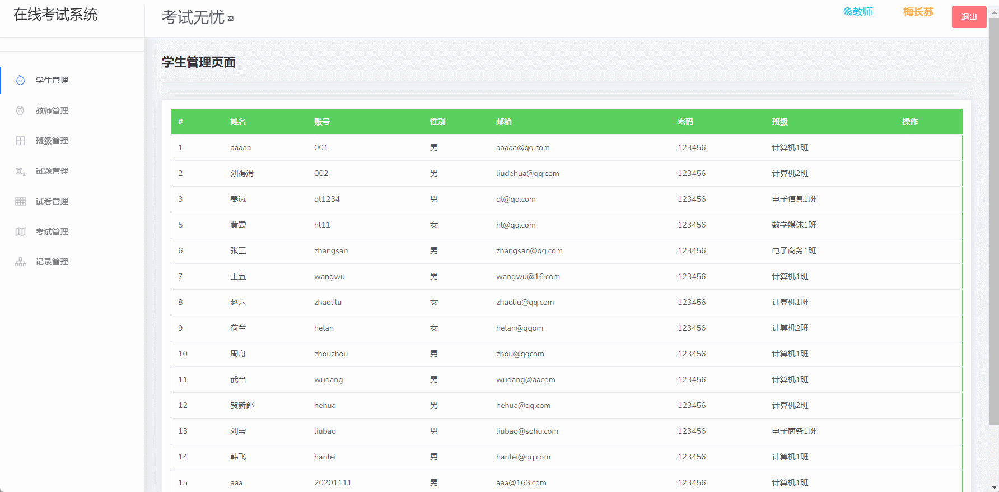
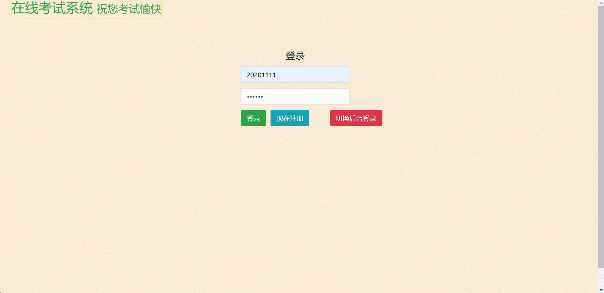

#  online_exam🎂

基于SpringBoot+Thymeleaf的在线考试系统

## 介绍🌞

> 系统中主要有学生、教师、试题、班级、试卷、考试、记录等信息的管理功能、还有如学生在线答题等一些功能。

## 软件架构

+ 管理员可以对记录管理、试卷管理、系统首页、学生管理、班级管理、考试管理、试题管理等八个功能进行操作。

+ 老师可以对考试管理、试卷管理、试题管理等功能进行操作

+ 学生可以考试并且查看自己的考试记录

## 项目演示🌞

> 管理员


> 老师端



> 学生



## 安装教程🌞

```
1. 运行环境准备mysql8 + java8 + node14.16.1

2. 配置maven路径，加载依赖

3. 运行sql文件，确保application.yml或config.properties的数据库名称和账号密码是数据库所在主机的账号密码
```


## 使用说明🌞

```
1. 登入

	管理员账号：admin 密码：123456

	老师账号：20201001 密码： 123456

	客户账号：001 密码：123456
  
2. 运行流程

SpringBoot+Vue项目的部署详情可以查看这篇CSDN博客：http://t.csdnimg.cn/kpuxS

前后端不分离项目的部署流程可以查看这篇CSDN博客：http://t.csdnimg.cn/CslA5
```


## CSDN项目合集🌞

点击前往：http://t.csdnimg.cn/Q4u84


## 联系我🌞

**有偿获取完整源码或调试代码**

🐧：1902317191

微信：


