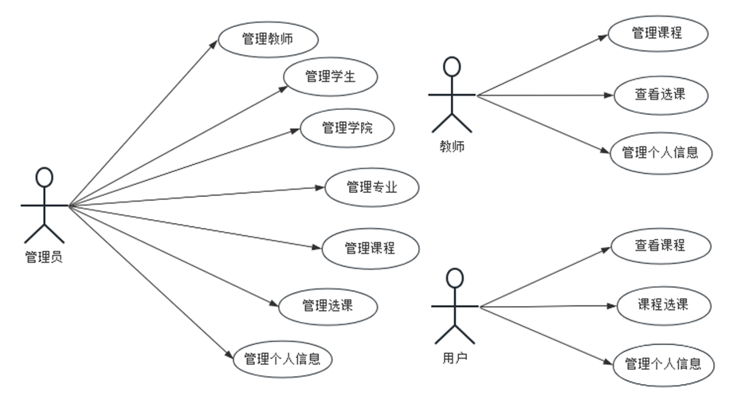
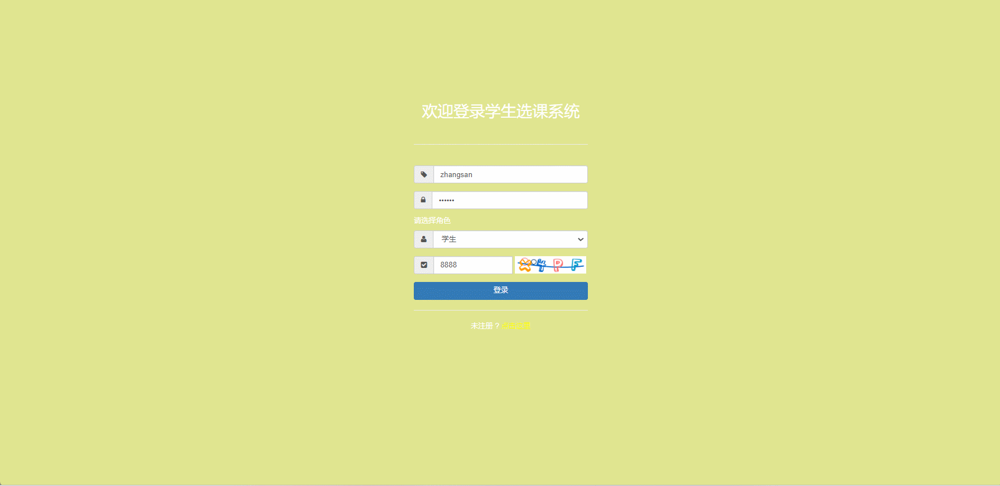
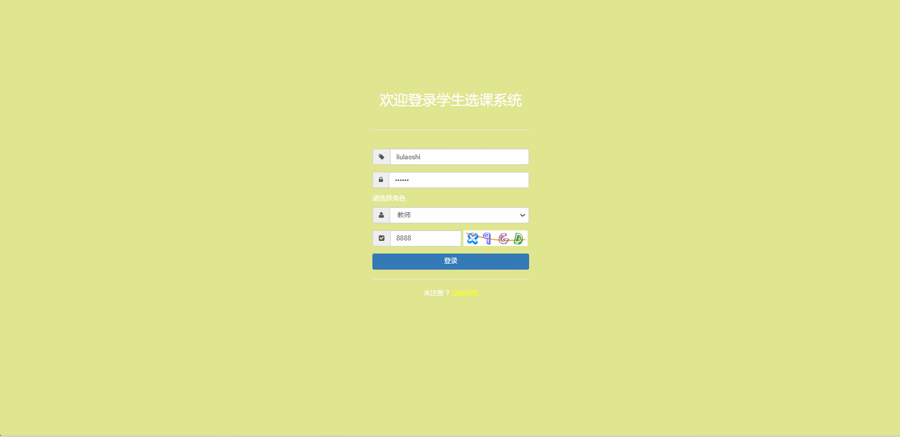
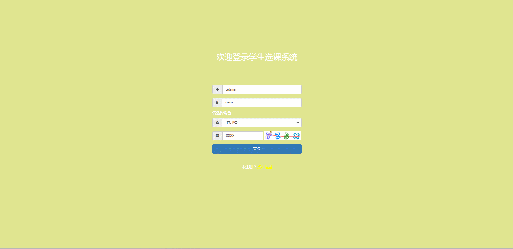

#  course_selection🎂

基于SpringBoot+Thymeleaf的学生选课系统

## 介绍🌞

> 该系统实现了用户信息管理与查询、课程信息管理、学生选课管理、教师排课管理等功能。学生端可以直观地浏览课程信息，选择心仪的课程，并查看选课结果。教师端则能方便地管理自己的课程，查看选课学生名单等操作。

## 软件架构



## 项目演示🌞

> 学生端



> 老师端



> 管理员端



## 安装教程🌞

```
1. 运行环境准备mysql8 + java8

2. 配置maven路径，加载依赖

3. 运行sql文件，确保application.yml或config.properties的数据库名称和账号密码是数据库所在主机的账号密码
```


## 使用说明🌞

```
1. 登入

      管理员账号：admin 密码：123456

 	  老师账号：liulaoshi 密码：123456

	  客户账号：zhangsan 密码：123456
  
2. 运行流程

SpringBoot+Vue项目的部署详情可以查看这篇CSDN博客：http://t.csdnimg.cn/kpuxS

前后端不分离项目的部署流程可以查看这篇CSDN博客：http://t.csdnimg.cn/CslA5
```


## CSDN项目合集🌞

点击前往：http://t.csdnimg.cn/Q4u84


## 联系我🌞

**有偿获取完整源码或调试代码**

🐧：1902317191

微信：


